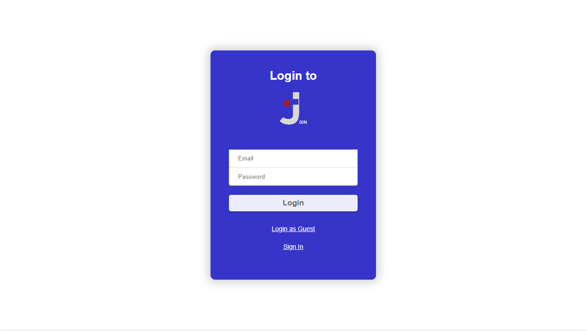
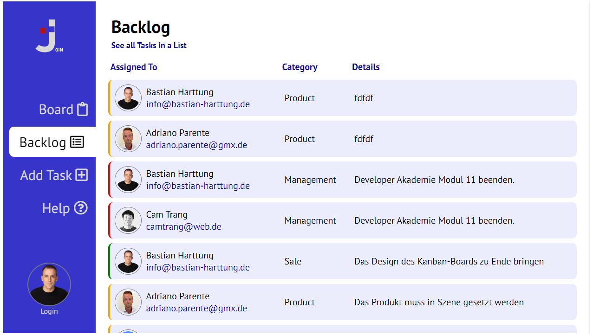

# Join Kanban-Board
This is a simple-to-use Kanban-Board. Have fun and enjoy the 
possibilities.

### Login
- You can Login with your E-Mail Adress and Password
- You can Sign In with Name, E-Mail and Password
- Or you can try Join by Login as a Guest

### Add Task
- Add Task by type in Title, Due Date and other Things
- Add User to the Task and create Task

### Board
- Here you can drag and drop tasks to different Status
- If you click on one Task you see Details of it or delete it

### Backlog
- You can see all Tasks with all Users who are assigned to the task

#### Last Infos
This project was done as a group project during the training at the Developer Academie.